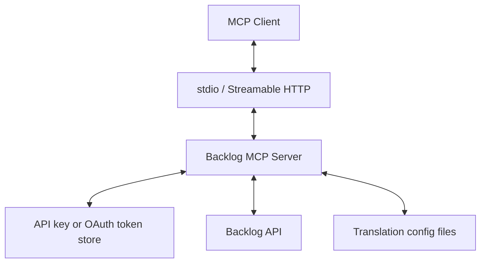
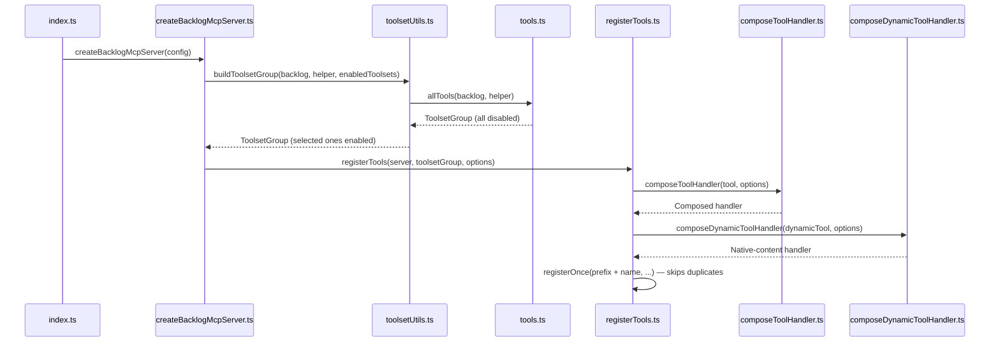
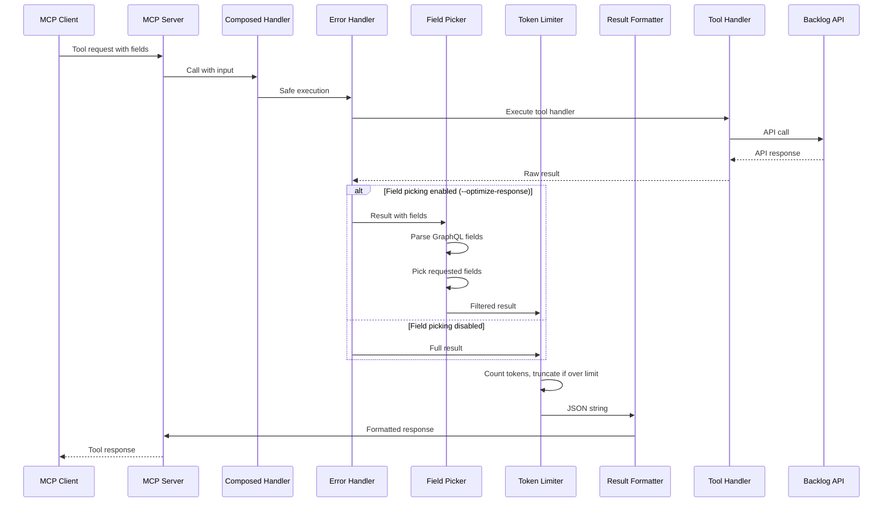
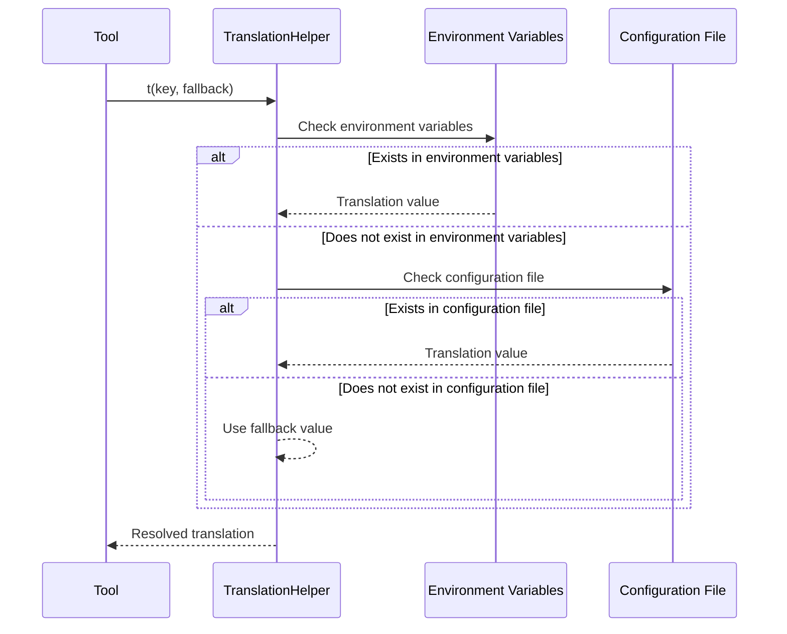
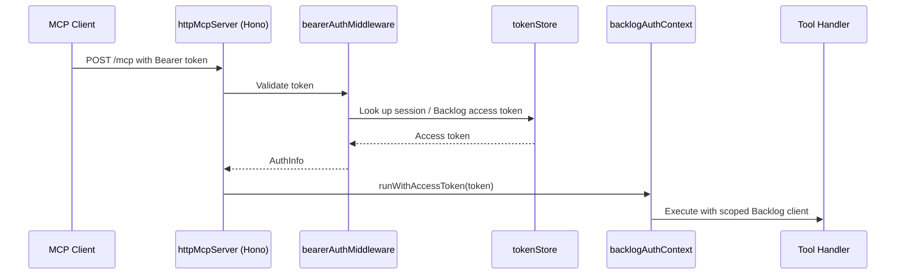
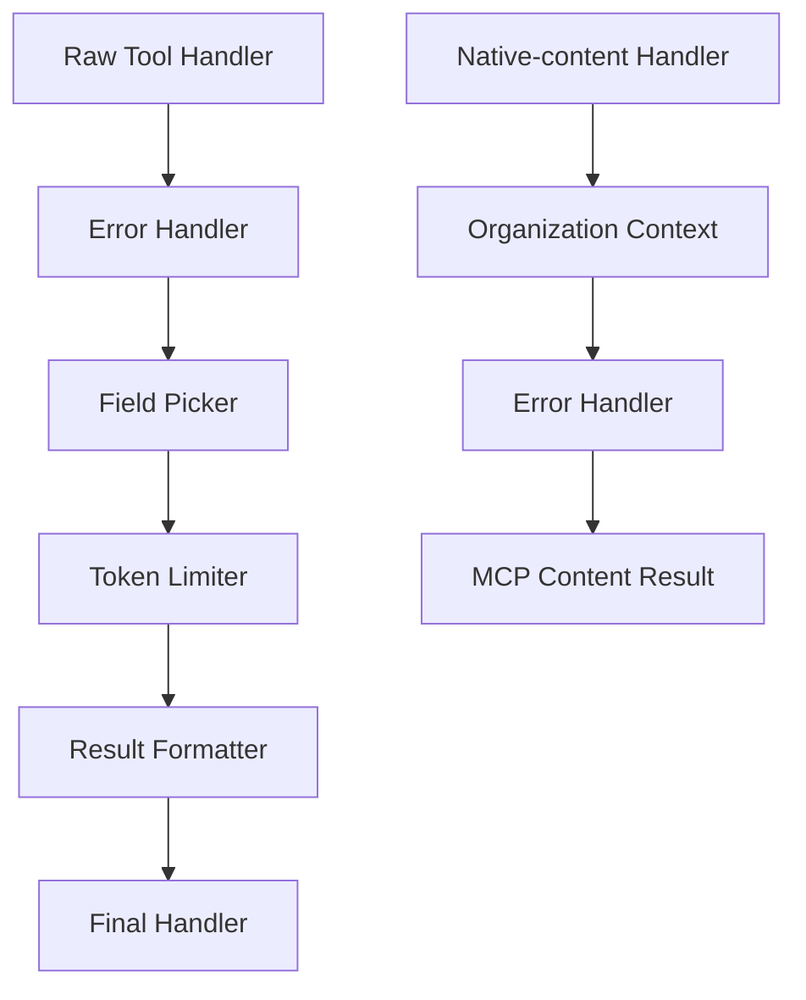

# System Patterns

## Architecture Overview

The Backlog MCP Server functions as a bridge between an MCP client and the Backlog API. The system consists of the following main components:



## Main Components

### 1. Entry Point (`index.ts`)

- Parses CLI flags and environment variables with yargs / env-var
- Chooses the transport: stdio (default) or Streamable HTTP (`--transport http`)
- Builds a `createServer` factory: one server per stdio connection, one fresh server per HTTP request

### 2. MCP Server Factory (`createBacklogMcpServer.ts`)

- Creates an `McpServer` from `@modelcontextprotocol/server`, wrapped by
  `wrapServerWithToolRegistry` so duplicate tool names are registered only once
- Builds the enabled toolset group and registers static tools, organization tools,
  and (optionally) dynamic toolset tools

### 3. Toolset System

- Tools are grouped into toolsets: `space`, `project`, `issue`, `wiki`, `git`, `document`, `notifications`
- Every toolset starts `enabled: false`; `buildToolsetGroup` enables the ones selected
  by `--enable-toolsets` / `ENABLE_TOOLSETS` (default `all`)
- A toolset can contain structured JSON `tools` and native-content `dynamicTools`.
  Native-content tools return MCP content blocks directly, which is required for
  binary images and embedded resources.
- With `--dynamic-toolsets`, the tools `enable_toolset`, `list_available_toolsets`, and
  `get_toolset_tools` let the client turn toolsets on at runtime through a `ToolRegistrar`

### 4. Translation System

- Translation helper for multi-language support
- Loads translations from configuration files (cosmiconfig) or environment variables
- Ensures descriptions are always displayed with fallback functionality

### 5. Backlog API Client

- Communicates with the Backlog API using the `backlog-js` library
- `backlogClientRegistry` creates a scoped client: API-key based, or OAuth based where the
  access token is resolved per request from `backlogAuthContext` (AsyncLocalStorage)

### 6. HTTP Transport and OAuth (`httpMcpServer.ts`, `src/auth/`)

- Hono app serving the Streamable HTTP MCP endpoint. MCP `2026-07-28` has no protocol
  sessions, so `createMcpHandler` builds a fresh server per request; clients on
  `2025-11-25` and earlier are served statelessly over the same endpoint
- DNS-rebinding protection via the `Host` / `Origin` middlewares from
  `@modelcontextprotocol/hono`. `Host` and `Origin` are configured independently:
  a bare loopback bind defaults both to the localhost set, while `allowedHosts` /
  `allowedOrigins` each override their own axis
- When OAuth is configured, the server also exposes OAuth metadata, dynamic client
  registration, `/authorize`, `/callback`, and `/token`, and guards MCP requests with
  a bearer auth middleware backed by an in-memory token store

## Design Patterns

### 1. Factory Pattern

- The `allTools` function receives a Backlog client and translation helper, generating
  a toolset group containing every tool instance
- Each tool has its own definition and implementation while providing a unified interface

### 2. Dependency Injection

- Backlog client and translation helper are injected into tools
- Mock objects can be injected during testing for easier unit testing
- Options for field picking and token limiting are injected into handlers

### 3. Adapter Pattern

- Converts Backlog API responses to MCP tool output format
- Adapts diverse response formats from different API endpoints to a unified format

### 4. Strategy Pattern

- Translation system selects appropriate translations from different sources
  (environment variables, configuration files, default values)
- Registration strategy differs between structured tools, native-content tools, and
  standalone control tools, while sharing the same `registerToolsets` loop

### 5. Decorator Pattern

- Tool handlers are wrapped with various transformers (error handling, field picking,
  token limiting, result formatting)
- Each transformer adds specific functionality while maintaining the same interface

### 6. Pipeline Pattern

- Structured response processing follows a clear pipeline:
  handler → organization routing → error handling → field picking → token limiting → result formatting
- Native-content tools use a smaller pipeline:
  handler → organization routing → error handling → MCP content result

## Important Implementation Paths

### Tool Registration Flow



### Request Processing Flow



### Translation Resolution Flow



### OAuth Request Flow (HTTP transport)



## Component Relationships

### Tool Structure

Each tool has the following structure:

- **Name**: Identifier representing the API endpoint
- **Description**: Description of the tool's functionality (translatable)
- **Schema**: Definition of input parameters (Zod)
- **OutputSchema**: Definition of output structure (Zod, for field picking)
- **ImportantFields**: List of fields that are most commonly needed (for examples)
- **Handler**: Function that performs the actual processing

Native-content tools omit `OutputSchema` and `ImportantFields`; their handlers
return MCP `CallToolResult` content blocks directly.

### Handler Composition Structure



### File Structure

```
src/
├── index.ts                       # Entry point (CLI flags, transport selection)
├── createBacklogMcpServer.ts      # MCP server factory
├── httpMcpServer.ts               # Streamable HTTP transport (Hono)
├── registerTools.ts               # Tool registration logic
├── createTranslationHelper.ts     # Translation helper
├── auth/                          # OAuth support for the HTTP transport
│   ├── backlogAuthContext.ts      # Per-request access token context
│   ├── backlogOAuthClient.ts      # Backlog OAuth client
│   ├── backlogOAuthConfig.ts      # OAuth configuration from env
│   ├── bearerAuthMiddleware.ts    # Bearer token validation
│   ├── oauthRoutes.ts             # OAuth metadata / authorize / token routes
│   └── tokenStore.ts              # In-memory token store
├── backlog/
│   ├── backlogErrorHandler.ts     # Backlog-specific error handling
│   ├── customFields.ts            # Custom field helpers
│   └── parseBacklogAPIError.ts    # Error parsing utilities
├── handlers/
│   ├── builders/
│   │   ├── composeToolHandler.ts         # Structured handler composition
│   │   └── composeDynamicToolHandler.ts  # Native-content handler composition
│   └── transformers/
│       ├── wrapWithErrorHandling.ts
│       ├── wrapWithFieldPicking.ts
│       ├── wrapWithOrganizationContext.ts
│       ├── wrapWithTokenLimit.ts
│       └── wrapWithToolResult.ts
├── tools/
│   ├── tools.ts                   # Toolset definitions (all tools)
│   ├── dynamicTools/              # organizations.ts, toolsets.ts
│   ├── getSpace.ts                # Individual tool implementation
│   ├── getSpace.test.ts           # Corresponding test
│   └── ...                        # Other tools
├── types/
│   ├── mcp.ts                     # MCP-related types
│   ├── result.ts                  # Result types
│   ├── tool.ts                    # Tool definition types
│   ├── toolsets.ts                # Toolset types
│   └── zod/                       # Zod schema definitions
└── utils/
    ├── backlogClientRegistry.ts   # API-key / OAuth scoped clients
    ├── generateFieldsDescription.ts
    ├── logger.ts                  # pino logger
    ├── resolveIdOrKey.ts          # Accept both IDs and keys
    ├── runToolSafely.ts           # Safe tool execution
    ├── tokenCounter.ts            # Token counting utilities
    ├── toolRegistrar.ts           # Runtime registration for dynamic toolsets
    ├── toolsetUtils.ts            # Toolset enabling logic
    └── wrapServerWithToolRegistry.ts
```

## Test Strategy

- Create unit tests corresponding to each tool
- Use mocks to eliminate external dependencies on the Backlog API
- Focus on validating input parameters and output format
- Use translation helper mocks to test translation functionality
