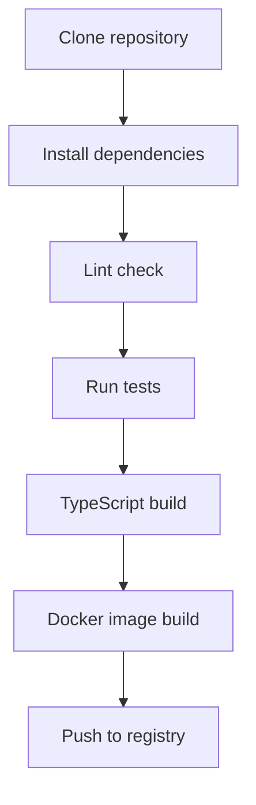

# Technical Context

## Technologies Used

### Languages and Runtime

- **TypeScript**: Static typing for improved safety and development efficiency
- **Node.js**: Server-side JavaScript runtime. `package.json` requires `>=22`;
  the repository pins the development/CI version in `.tool-versions` (Node 24.x),
  and the Docker images are built on `node:24`

### Key Libraries

- **@modelcontextprotocol/sdk**: Implementation of MCP (Model Context Protocol) server
- **backlog-js**: Client library to simplify communication with Backlog API
- **zod**: Provides schema validation and type safety
- **cosmiconfig**: Configuration file loading and management
- **graphql**: Used for field selection parsing and processing
- **hono** / **@hono/node-server**: HTTP server for the Streamable HTTP transport and OAuth routes
- **yargs** / **env-var**: CLI flag and environment variable parsing
- **pino** / **pino-pretty**: Structured logging

### Development Tools

- **Vitest**: Fast and modern testing framework powered by Vite
- **ESLint**: Code quality and style validation
- **Prettier**: Code formatting
- **release-it**: Release management automation (via the release workflow)

### Containerization

- **Docker**: Application containerization with multi-stage builds
- **GitHub Container Registry**: Container image distribution

## Development Environment Setup

### Prerequisites

- Node.js (see `.tool-versions`; `engines` requires v22 or higher)
- pnpm (the `preinstall` script enforces pnpm via `only-allow`)
- Git

### Installation Steps

```bash
# Clone the repository
git clone https://github.com/nulab/backlog-mcp-server.git
cd backlog-mcp-server

# Install dependencies
pnpm install

# Build
pnpm run build
```

### Environment Variables

Create a `.env` file during development (loaded via `process.loadEnvFile()`, optional):

```
BACKLOG_DOMAIN=your-domain.backlog.com
BACKLOG_API_KEY=your-api-key
```

Optional settings (each also has an equivalent CLI flag):

| Variable                    | Purpose                                                  |
| --------------------------- | -------------------------------------------------------- |
| `MAX_TOKENS`                | Max tokens in a response (default 50000)                  |
| `OPTIMIZE_RESPONSE`         | Enable GraphQL-style field selection                      |
| `PREFIX`                    | Prefix prepended to every tool name                       |
| `ENABLE_TOOLSETS`           | Comma-separated toolsets to enable (default `all`)        |
| `ENABLE_DYNAMIC_TOOLSETS`   | Expose `enable_toolset` and friends                       |
| `MCP_TRANSPORT`             | `stdio` (default) or `http`                               |
| `MCP_HTTP_HOST` / `_PORT` / `_PATH` | HTTP transport bind settings                      |
| `MCP_HTTP_JSON_RESPONSE`    | Prefer JSON responses over SSE                            |
| `MCP_HTTP_ALLOWED_HOSTS`    | Allowed `Host` values (DNS rebinding protection)          |
| `BACKLOG_OAUTH_CLIENT_ID` / `_SECRET`, `MCP_SERVER_BASE_URL` | Enable OAuth on the HTTP transport |

## Technical Constraints

### Backlog API

- Be mindful of API rate limits
- Some APIs require specific permissions
- API keys are issued per user and operate with that user's permissions
- Large responses may need pagination or token limiting

### MCP Protocol

- Two transports are supported: stdio and Streamable HTTP
- With HTTP, a fresh MCP server instance is created per session
- Tool inputs and outputs must follow specific formats
- Response size should be managed to avoid token limit issues

### Containerization

- Multi-stage builds used to maintain lightweight container images
- Supports cross-architecture builds (amd64, arm64)
- Environment variables must be properly passed to containers

## Build and Deploy

### Build Process



### CI/CD

- Automation using GitHub Actions (`.github/workflows/ci.yml`, `release.yml`)
- Node.js version comes from `.tool-versions` (`node-version-file`)
- Testing and validation for each pull request
- Automatic release on tag push
- Building and publishing multi-architecture Docker images

### Deployment Options

1. **Docker**:

   ```bash
   docker run -i --rm \
     -e BACKLOG_DOMAIN=your-domain.backlog.com \
     -e BACKLOG_API_KEY=your-api-key \
     -v /path/to/.backlog-mcp-serverrc.json:/root/.backlog-mcp-serverrc.json:ro \
     ghcr.io/nulab/backlog-mcp-server
   ```

2. **npx**:

   ```bash
   BACKLOG_DOMAIN=your-domain.backlog.com \
   BACKLOG_API_KEY=your-api-key \
   npx backlog-mcp-server
   ```

3. **Node.js**:

   ```bash
   BACKLOG_DOMAIN=your-domain.backlog.com \
   BACKLOG_API_KEY=your-api-key \
   node build/index.js
   ```

4. **Streamable HTTP** (optionally with OAuth):

   ```bash
   MCP_TRANSPORT=http MCP_HTTP_PORT=3333 node build/index.js
   ```

## Test Strategy

### Unit Tests

- Testing framework using Vitest (fast and modern, powered by Vite)
- Using mocks with vi (Vitest's mocking API) to isolate Backlog API dependencies
- Creating test files corresponding to each tool
- Support for watch mode for better development experience

### Running Tests

```bash
# Run all tests
pnpm test

# Run tests in watch mode
pnpm run test:watch

# Run tests with coverage
pnpm run test:coverage

# Run specific tests
pnpm test -- -t "getSpace"
```

## Performance Considerations

- Minimizing API requests
- Appropriate error handling
- Pagination handling when dealing with large amounts of data
- Token limiting for large responses (truncation once the limit is exceeded)
- Field selection to reduce response size
- Toolset selection to keep the advertised tool list small

## Security Considerations

- Secure management of API keys
- Injection of sensitive information through environment variables
- OAuth tokens are held in an in-memory token store and expire; no persistence on disk
- HTTP transport binds to `127.0.0.1` by default and validates `Host` headers
  (DNS rebinding protection) when bound more widely
- Principle of least privilege in containers
- Input validation to prevent injection attacks

## Multi-language Support

- Multi-language support through translation files
- Translation overrides through environment variables
- Translation customization through configuration files (`.backlog-mcp-serverrc.json`)
- Fallback to default language (English)
- Translation key tracking for consistency, dumpable via `--export-translations`

## Response Optimization

### Field Selection

- GraphQL-style field selection syntax
- Enabled with `--optimize-response` / `OPTIMIZE_RESPONSE` (off by default)
- Allows clients to request only needed fields
- Example: `{ id name description }`

### Token Limiting

- Configurable maximum token limit (default: 50,000)
- Can be set via environment variable or CLI argument
- Responses over the limit are truncated with a notice appended

### Error Handling

- Categorized error types (authentication, API, unexpected, unknown)
- Consistent error response format
- Detailed error messages for debugging
- Backlog API-specific error parsing
